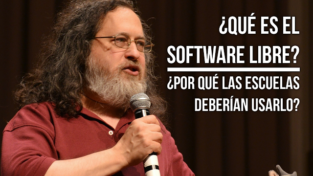
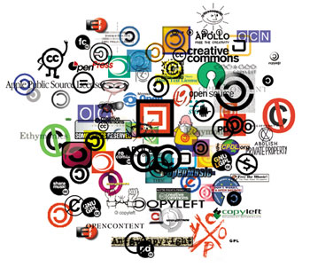
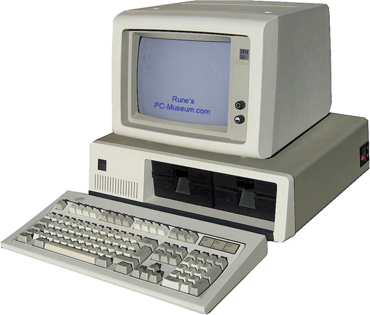

# 

# 

Programa de uso y difusión del Software Libre

#

Secretaría de Extensión y Asistencia Técnica,
Facultad de Ciencias Económicas, UNRC

# ¿Qué es el Software?

# Software Privativo

Software No Libre

# Software Libre

# ¿Qué es el Software Libre?

El Software Libre es aquel que respeta la libertad de las usuarias para ejecutarlo, copiarlo, distribuirlo, estudiarlo, modificarlo y mejorarlo

# ¿Qué es el movimiento del software libre?

Promueve que las usuarias de computadoras obtengan la libertad que otorga el software libre. El software libre permite que las usuarias ejerzan el control de sus propias tareas de computación

# Richard Stallman

# Libertades

Respeta 4 libertades esenciales

* Ejecutar
* Estudiar
* Copiar
* Modificar

# Ejecutar

La libertad de usar el programa, con cualquier propósito

# Estudiar

La libertad de estudiar cómo funciona el programa y modificarlo en relación a necesidades específicas

# Copiar

La libertad de distribuir copias del programa, con lo cual se puede ayudar a otros usuarios.

# Modificar

La libertad de mejorar el programa y hacer públicas esas mejoras para que toda la comunidad pueda beneficiarse de ellas

# Free Software. Software Libre (Libre ≠ gratis)

El software libre es una cuestión de libertad, no de precio. Para entender el concepto, debe pensarse en «libre» como en «libertad de expresión», no como en «cerveza gratis»

# Copyleft

[¿Qué es el copyleft?](https://www.gnu.org/licenses/copyleft.es.html)

# ¿Qué es GNU?

#

# Licencia GPL

# Licencias para software

Licencias de software libre compatibles con la GPL
[https://www.gnu.org/licenses/license-list.es.html](https://www.gnu.org/licenses/license-list.es.html)

# ¿Qué es Linux?

# ¿Qué es GNU/Linux?

# GNU/Linux

# Distribuciones GNU/Linux

# ¿Qué podemos hacer con SL?

# 

# 

# 

# 

# 

# Estándares 

Consensuados, Libres y Abiertos Vs de facto

Crear un ambiente favorable para que el Software Libre pueda prosperar

# Ética

"El Software Libre no es un asunto técnico, es un asunto ético del
uso de las tecnologías, porque el Software Libre respeta la libertad
del usuario y la solidaridad social de su comunidad" RMS

# Combatir la OBSOLESCENCIA PROGRAMADA

una distro para cada requerimiento

# 

Comprar, tirar, comprar

# Actualizaciones

# WannaCry

# Tecnología nacional y desarrollo asociado

#

# La familia unida.

El conocimiento liberado de patentes, con apoyo del Estado y una academia conectada con las necesidades de la industria, puede facilitar el desarrollo tecnológico local.

# 

# Agradecimientos

# Bibliografía

[El derecho a leer (Richard Stallman)](https://www.gnu.org/philosophy/right-to-read.es.html)

[Software libre para una sociedad libre (Richard Stallman)](https://www.gnu.org/philosophy/fsfs/free_software.es.pdf)

[P/12: Tecnología nacional y desarrollo asociado](https://www.pagina12.com.ar/40391-la-familia-unida)

[Video de Richard Stallman para el FLISOL 2009](https://vimeo.com/4152803)

#

